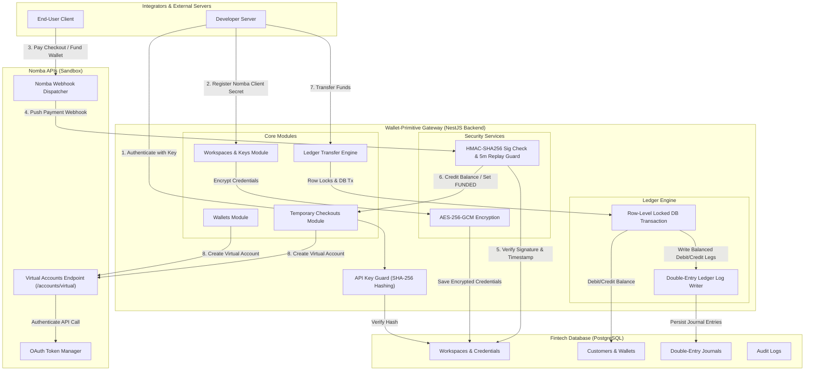

# Wallet-Primitive (Backend System)

A secure, multi-tenant B2B payment gateway and double-entry ledger routing engine built on NestJS, integrating directly with **Nomba's Sandbox API**. 

Built for Team **JACK** (Nomba x DevCareers Hackathon 2026).

---

## 🏗️ System Architecture

The master flow below details how developer requests, webhook alerts, cryptographic security, the database, and Nomba's APIs interact:



---

## 🚀 Core Features

### 1. Multi-Tenant Developer Workspaces
* **Onboarding**: Developers can register workspaces and developer accounts.
* **API Key Rotation & Revocation**: Keys are randomly generated (`wp_live_...`), hashed using **SHA-256**, and stored securely. Lost or leaked keys can be listed and deleted/revoked via administrative endpoints.
* **Encrypted Sandbox Credentials**: API client secrets and sub-account IDs are stored using industry-standard **AES-256-GCM encryption at rest**, decrypting only on-demand during Nomba API calls.

### 2. Smart Virtual Wallets
* **Customer Virtual Accounts**: Onboard end-customers and automatically provision virtual wallets powered by Nomba's virtual account APIs.
* **Alphanumeric Name Sanitization**: Automatically cleanses customer and order names (collapsing multiple spaces and stripping non-alphanumeric symbols) to bypass Nomba Sandbox's strict 400 validation constraints.

### 3. Double-Entry Accounting Ledger
* **Atomic Transfers**: Move money internally between customer wallets with zero risk of balance duplication or data corruption.
* **Lock-Safe Balance Operations**: Applies row-level locking during transfers to prevent double-spending under concurrent API requests.
* **Linked Ledgers**: Every transfer writes a balanced `DEBIT` and `CREDIT` leg sharing a unique `transactionGroupId` for full transaction auditing.

### 4. Dynamic Checkout Temporary Accounts
* **Dynamic Virtual Accounts**: Generate temporary checkout accounts for payments with an `expectedAmount` and an expiration time limit.
* **Automated Status Transitions**: webhooks automatically verify deposit amounts, increment `receivedAmount`, and transition the status to `FUNDED` once the goal is reached.

### 5. Webhook Security
* **HMAC-SHA256 Signatures**: Incoming webhooks are verified using cryptographic signature checks matching Nomba's specifications.
* **Replay Attack Protection**: In production, the system automatically rejects webhooks with a time drift greater than 5 minutes.

---

## 🛠️ Technology Stack
* **Framework**: [NestJS](https://nestjs.com/) (TypeScript)
* **Database**: [PostgreSQL](https://www.postgresql.org/)
* **ORM**: [Prisma](https://www.prisma.io/)
* **Validation**: [Zod](https://zod.dev/) via `nestjs-zod`
* **API Docs**: [Swagger OpenAPI](https://swagger.io/)
* **Env Management**: [Dotenvx](https://dotenvx.com/)

---

## ⚙️ Getting Started

### 1. Prerequisites
Ensure you have the following installed:
* [Node.js](https://nodejs.org/) (v20+)
* [PNPM](https://pnpm.io/)
* [Docker & Docker Compose](https://www.docker.com/)

### 2. Installation
Clone the repository and install dependencies:
```bash
pnpm install
```

### 3. Set Up Environment Variables
Copy the `.env.example` file to `.env`:
```bash
cp .env.example .env
```
Populate `.env` with your variables (including your GCM `ENCRYPTION_KEY` which must be a 32-character string).

### 4. Run Docker Services (PostgreSQL & Redis)
Spin up the local database and cache services:
```bash
docker compose up -d
```

### 5. Run Database Migrations & Seeds
Apply schema migrations and seed the initial mock data:
```bash
pnpm run db:migrate --name init
pnpm run db:seed
```

### 6. Start the Development Server
```bash
pnpm run start:dev
```
The server will start at `http://localhost:9999`.

---

## 📖 API Documentation & Testing

When the server is running, the interactive Swagger OpenAPI docs are served at:
👉 **`http://localhost:9999/api`**

### Testing Flow:
1. **Authorize**: Click **"Authorize"** at the top right of the Swagger UI and enter the seeded key `wp_test_1234567890`.
2. **Onboard**: Register your credentials via `POST /api/v1/workspaces/{workspaceId}/credentials`. If you don't have Nomba keys, prefix your values with `mock-` to run in local mock mode.
3. **Onboard Customers**: Create customers (`POST /customers`) and open wallets (`POST /wallets`).
4. **Simulate Webhooks**: Test the incoming payment flow using the `POST /webhook/nomba` endpoint.
