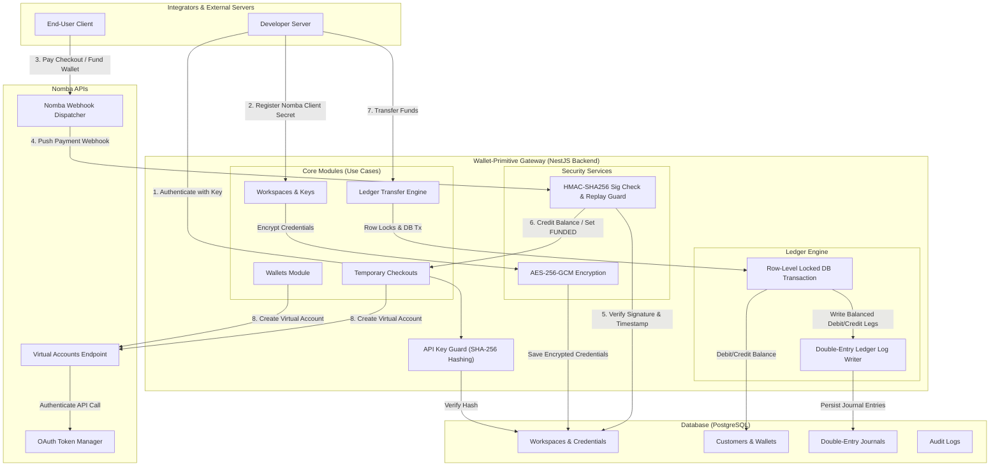

Wallet Primitive utilizes an event-driven, transaction-locked design that links inbound payment notifications directly to a double-entry ledger.

## Interaction Flow Diagram

Below is the master component relationship flow:

## Architectural Highlights

### 1. Zero-Trust API Key Validation
Every B2B request requires the `x-api-key` header. The gateway extracts the key, hashes it using SHA-256, and queries the database for match verification. Plain API keys are never stored in the database.

### 2. Multi-Tenant Encryption at Rest
Integration keys (client secret, sub-account credentials) provided by developers are encrypted using AES-256-GCM before saving to PostgreSQL. They are decrypted dynamically inside `NombaService` during API calls.

### 3. ACID-Wrapped Ledger
Monetary transfers employ explicit PostgreSQL transaction locks (`$transaction`). If a debit succeeds but a credit fails (or vice versa), the entire transaction rolls back immediately, keeping ledger integrity absolute.
